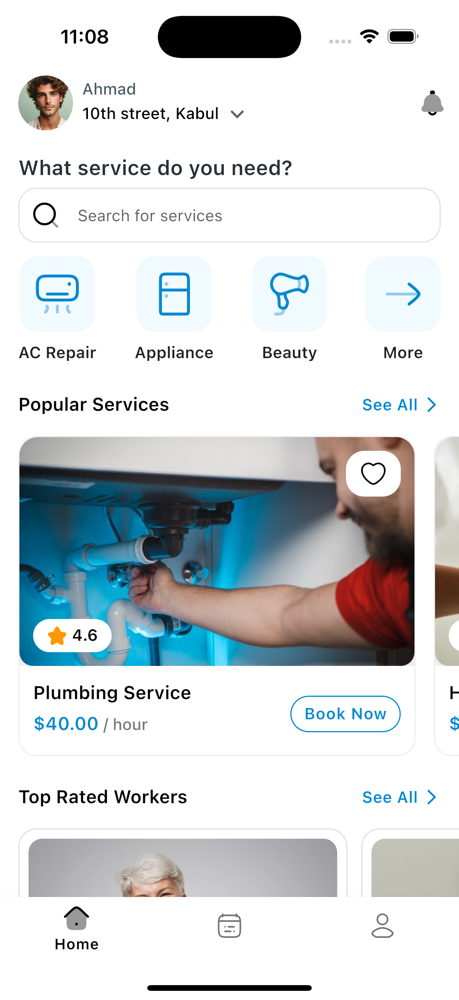

# Flutter Home Service Application UI Kit - Homy

> **🛒 How to Purchase**
>
> To get the full version of this UI kit with all features and screens, visit the [Homy UI Kit product page](https://afgprogrammer.com/) and follow the purchase instructions. After purchase, you'll receive access to the complete source code and future updates.

A complete Flutter UI kit for a home service application, designed to help you build a beautiful and functional app quickly. This UI kit includes multiple screens, components, and features essential for a home service platform, such as booking workers, rating services, messaging, and more. The project is built using Flutter and Dart, and is designed to be easy to customize and extend, allowing you to create a unique app that meets your specific needs.

## Features
- Modern and attractive UI design
- Multiple screens including home, service details, booking, and more
- Worker listing with profiles, ratings, and service details
- Booking and scheduling functionality
- User authentication screens
- Search and filter services
- In-app messaging between users and workers
- Service rating and review system

## Getting Started
To purchase the full version of this UI kit, please visit [Homy UI Kit](https://afgprogrammer.com/).

1. Clone this repository.
2. Run `flutter pub get` to install dependencies.
3. Configure any required API keys or tokens in the code.
4. Run `flutter run` to launch on your device or simulator.

## Screenshots

 | Page | Page
|---|---|
|  |  |
|  |  |
|  |

## Live Demo
[Live Demo](https://afgprogrammer.com/)

---